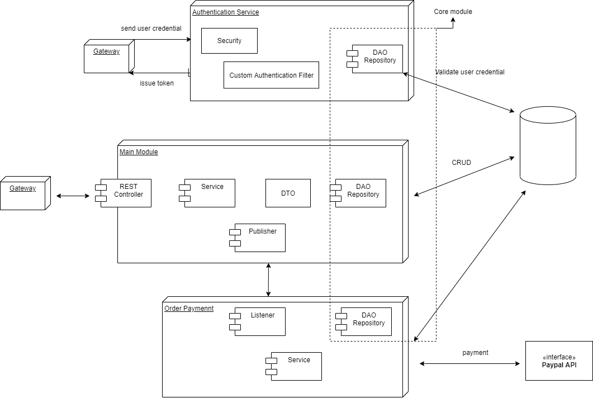

Online Store's documentation
============================

Overview
--------
This is an e-commerce web application for a small online shop focusing on selling CDs with quick delivery to customers.
The reason for building a e-commerce system is the focus on one-click payments.

Architecture
^^^^^^^^^^^^

Tables (TBD)
^^^^^^^^^^^^

Main tasks
^^^^^^^^^^
* Writing unit and integration tests using test-driven development
* Using Java, Spring 5, and Spring Boot 2
* Securing an application with Spring Security
* Accessing relation data in PostgreSQL using Spring Data
* Front-end development using Spring MVC, HTML, and CSS
* DevOps: preparing and deploying an application using Docker

Project Outline
^^^^^^^^^^^^^^^
.. list-table::
   :widths: 30 10 10
   :header-rows: 1

   * - Milestone
     - Due
     - Status
   * - Tech stack, project plan
     - Jan 17 2021
     - In progress
   * - Create skeleton services
     - Jan 31 2021
     - In progress
   * - Create Main module
     - Feb 7 2021
     - Not started
   * - Authentication Module
     - Feb 12 2021
     - Not started 
   * - Order payment module & queue messages
     - Feb 21 2021
     - Not started 
   * - Front-end 
     - TBD
     - In progress
   * - Login with Facebook, Oauth2, Keycloak
     - TBD
     - Not started

References
^^^^^^^^^^
* https://www.amazon.com/Learn-Microservices-Spring-Boot-Practical/dp/1484231643
* https://medium0.com/omarelgabrys-blog/microservices-with-spring-boot-intro-to-microservices-part-1-c0d24cd422c3
* https://spring.io/blog/2015/07/14/microservices-with-spring
* https://medium.com/dev-genius/liquibase-handling-database-in-spring-boot-dbdf237d2b3b